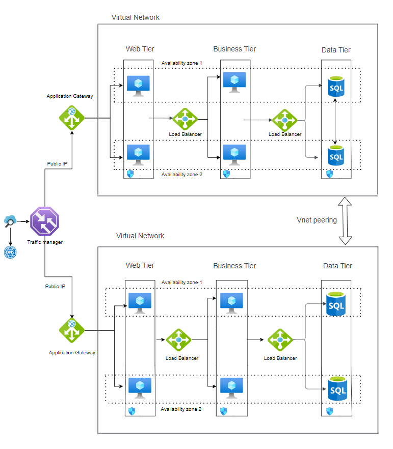

# Challange 1

## Problem statement

A 3-tier environment is a common setup. Use a tool of your choosing/familiarity create these
resources. Please remember we will not be judged on the outcome but more focusing on the
approach, style and reproducibility.

## Design

## Approach

I have divide my application into 3 layers:
1. Web tier: This is the top layer, and has the user interface. It parses user interactions and passes the actions to the business tier for processing.
2. Business tier: Processes the user interactions and determines the next steps. It connects the web and data tiers.
3. Data tier: Stores the application data, typically in a database, object storage, or files.

### Below are the resources that I m using for building 3 tier architecture and their description why I am using it?

1. Two azure regions for higher availability. If a regional outage affects the primary region, you can use Traffic Manager to fail over to the secondary region. Multiple regions can also help if an individual subsystem of the application fails.

2. Availability zones in each region: It provide high availability within a region.

3. Network Security Groups (NSG): Using Network Security Groups (NSG) rules to restrict network traffic within the virtual network. With the help of NSG we can restrict the communication between tiers. In our scenario I dont want our data tier to communicate with web tier but it should communicate with business tier.

4. Virtual network peering: It is used to seamlessly connect two virtual networks in Azure. The virtual networks are peered via Global virtual network peering to allow data replication from the primary region to the secondary region.
5. Virtual machines: VMs are on-demand, scalable computing resources that give you the flexibility of virtualization but eliminate the maintenance demands of physical hardware. 
6. Traffic Manager: It is used for DNS-based traffic routing. It is a kind of load balancer that distributes traffic optimally to services across global Azure regions while providing high availability and responsiveness. 
7. Application Gateway: It is used to routes HTTP requests to the web front end. 
8. Load Balancer: It is used to directs network traffic from the web tier to the business tier. 
9. DNS: It is a hosting service for DNS domains. With name resolution we can manage  DNS records using the same credentials, APIs, tools etc. It also provide name resolution within a virtual network, as well as between virtual networks.
10. Virtual Network: It is used to form a secure private network in the cloud. It connects VMs to one another, to the internet, and to on-premises networks.
